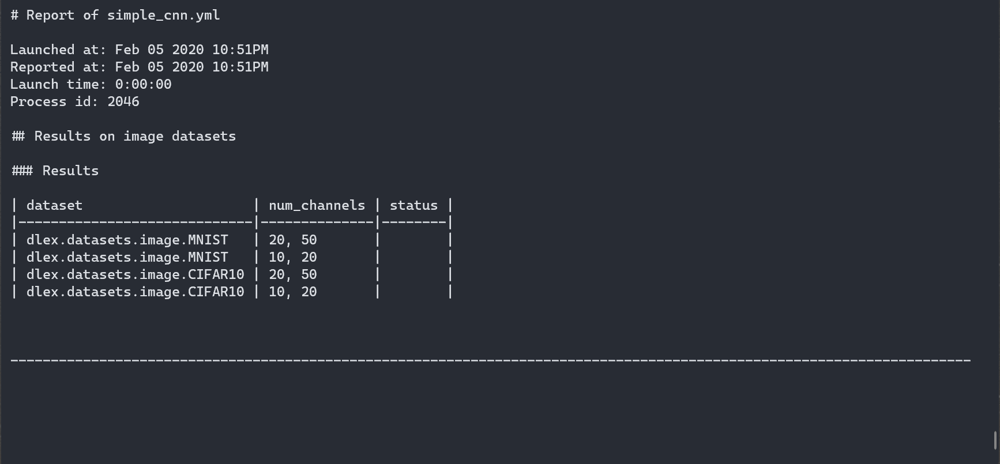

[!] This code is under development and mainly for my personal use. This project is for fast prototyping of deep learning and machine learning model with minimal code. Some parts of the code may not be well-commented or lack of citation.

dlex is an open source framework for machine learning scientific experiment. 

# Features

- [ ] Configuration-based experiment setup. Less code for more efficiency and reproducibility
- [ ] Pytorch or Tensorflow 2.0 or scikit-learn as backend with similar training flow
- [ ] Convenient "environment" for training similar models or tuning hyperparameter



# Install

```
pip install dlex
```

# Resources

- [Documentation](https://trungd.github.io/dlex/)
- [Getting Started](https://trungd.github.io/dlex/getting_started.html)
- [Various model implementations](dlex_impl/README.md)
- [Implementations of machine learning algorithms for graph](https://github.com/trungd/ml-graph/)